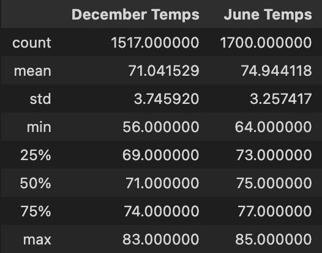
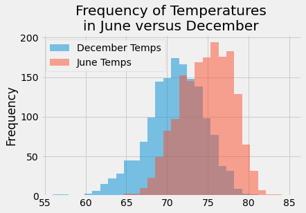
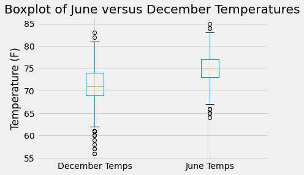

# Overview
The purpose of this analysis was to conduct temperature trend analysis for Oahu, Hawaii - this analysis would be used by an investor to determine if a surf shop would be able to remain open year round.

The months of June and December were targeted for analysis. From the weather dataset, the following queries were run to extract the necessary data:

```python
june_filter = session.query(Measurement.tobs).filter(extract('month', Measurement.date) == 6).all()
june_temps_df = pd.DataFrame(june_filter,columns=["June Temps"])

dec_filter = session.query(Measurement.tobs).filter(extract('month', Measurement.date) == 12).all()
dec_temps_df = pd.DataFrame(dec_filter,columns=["December Temps"])
```

# Results

The results of this temperature analysis were as follows:



## Observations:

1. The average temperatures differ by roughly four degrees (**December**: 71, **June**: 75)
2. December is generally colder than June - but not drastically, as many would consider typical 'winter' vs. 'summer' trends.



3. December features far more temperature outliers than June, making it a more volatile month in terms of temperature stability.



   1. However, considering the minimum of both datasets, they differ by only eight degrees (**December**: 56, **June**: 64).
   2. Maximum temperatures differ by only two degrees (**December**: 83, **June**: 85)

# Summary
After reviewing the results above, we can observe that the overall temperature trends between June and December do not yield considerable differences. December does present challenges, as the temperatures are lower and present more variance and outliers. However, if this overall temperature range still allows for surfing and customer traffic, then a surf shop looks like a promising investment,

**Two additional queries**: The following code yield the graphs used above in the **Results** section:

```python
# First, combine the two dataframes into a single dataframe
df_combined = dec_temps_df.join(june_temps_df,how='outer')

# Temperature frequency using a histogram:
fig = plt.figure()
ax = df_combined.plot.hist(bins=30,alpha=.5)
plt.title("Frequency of Temperatures\nin June versus December")
plt.savefig('Resources/output.png',bbox_inches='tight')

# Boxplot analysis:
fig1 = plt.figure()
ax1 = df_combined.boxplot()
plt.title("Boxplot of June versus December Temperatures")
plt.ylabel("Temperature (F)")
plt.savefig('Resources/output2.png',bbox_inches='tight')
